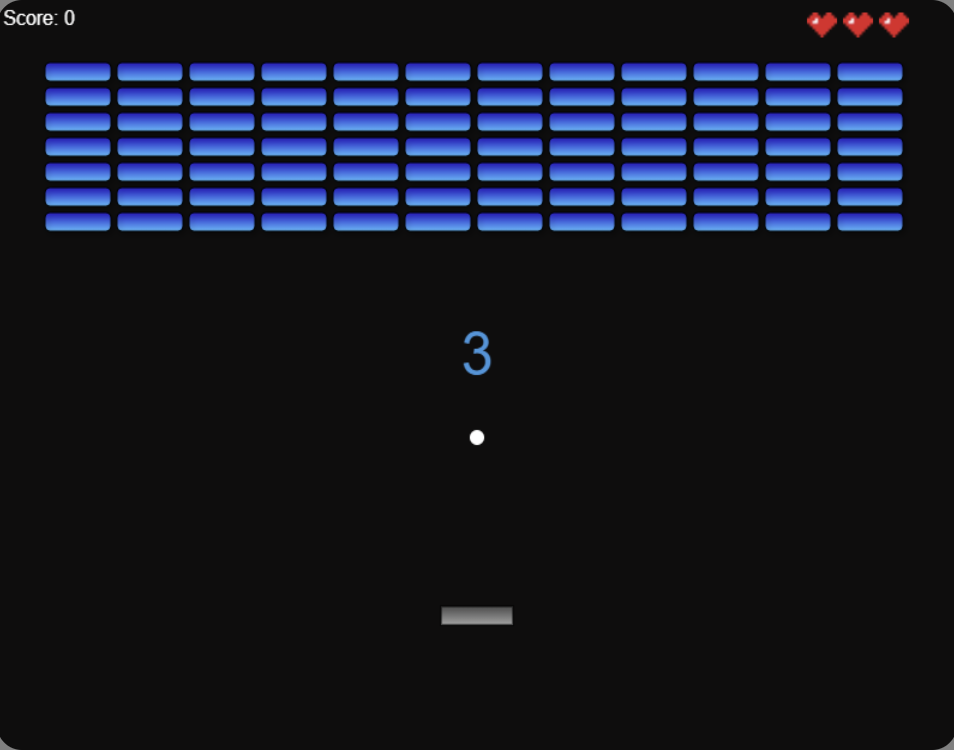

# Breakout Game

A classic brick-breaker game implemented in JavaScript using HTML5 Canvas. Control the paddle to bounce the ball and break all the bricks to advance through levels. Collect extra lives and aim for the highest score!

## Features

- **Multiple Levels**: Progress through levels with increasing difficulty.
- **Responsive Controls**: Use keyboard arrows or mouse to control the paddle.
- **Extra Lives**: Collect heart pickups to gain extra lives.
- **Dynamic Bricks**: Bricks with varying health require multiple hits.
- **Scoring System**: Earn points by breaking bricks.
- **Stylish Graphics**: Retro-inspired design with custom fonts and animations.

## Demo



## Getting Started

Follow these instructions to get a copy of the game running on your local machine.

### Prerequisites

- A modern web browser (Chrome, Firefox, Safari, Edge).
- Internet connection to load external fonts (or see the [Offline Usage](#offline-usage) section).

### Installation

1. **Clone the Repository**

   ```bash
   git clone https://github.com/zachdexter/BreakoutGame.git
   ```

2. **Navigate to the Project Directory**

    ```bash
    cd BreakoutGame
    ```

3. **Open the Game**

- **Option 1:**  Open `index.html` directly in your web browser.
    - Right-click on `index.html` and select "Open with" and choose your browser.
- **Option 2:** Use a local web server (recommended for some browsers).
    - **Python 3:**
        ```bash
        python -m http.server
        ```
        Then navigate to `http://localhost:8000` in your browser.
    - **Node.js:**
        ```bash
        npx http-server
        ```
        Then navigate to displayed URL.

## How To Play

- **Start the Game:** Click on the **Start Game** button.
- **Control the Paddle:**
    - **Mouse:** Move the paddle by moving your mouse horizontally.
    - **Keyboard:** Use the left and right arrow keys to move the paddle.
- **Objective:** Bounce the ball using the paddle to break all the bricks.
- **Lives:** You start with 3 lives. Collect extra lives by hitting heart pickups.
- **Levels:** Clear all bricks to advance to the next level.
- **Game Over:** Lose all your lives, and the game ends.
- **Restart:** Click on Restart Game to play again.

## Game Structure

- `index.html`: The main HTML file containing the canvas and buttons.
- `style.css`: CSS file for styling the game elements.
- `script.js`: JavaScript file containing the game logic.
- `heart.png`: Image asset for displaying lives.

## Offline Usage

To play the game without an internet connection: 
1. **Download the Font**
    - Visit [Google Fonts - Silkscreen](https://fonts.google.com/specimen/Silkscreen).
    - Download the font files and include them in your project.
2. **Update** `style.css` **to Use Local Font**
    Replace the `<link>` to Google Fonts wiht a local `@font-face` declaration.
    ```css
    @font-face {
    font-family: 'Silkscreen';
    src: url('fonts/Silkscreen-Regular.ttf') format('truetype');
    font-weight: 400;
    font-style: normal;
    }

    @font-face {
    font-family: 'Silkscreen';
    src: url('fonts/Silkscreen-Bold.ttf') format('truetype');
    font-weight: 700;
    font-style: normal;
    }
    ```
3. **Adjust Font Paths**
    Ensure the paths to the font files are correct relative to your `style.css`.

## Acknowledgements

- Inspired by classic arcade brick-breaker game
- Uses the Silkscreen font by Jason Kottke
